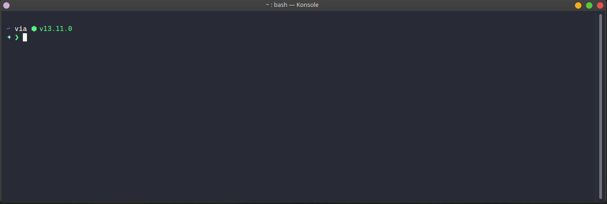

<p align="center">
    
</p>

<h1 align="center">Coronavirus Assistant</h1>
<h3 align="center">Spreading awareness about COVID-19 through your terminal</h3>

<p align="center">
    
</p>

## Features:

**🌐 100% Offline:** `covyd` is 100% offline. Making it blazing fast.

**🕺 Non-intrusive:** `covyd` will not interrupt your workflow. Your work is most important (after your health).

**🧑‍🤝‍🧑 Community Lead:** `covyd` cannot be without your contribution and help. You are what makes `covyd` great. So please share your stories, tips, jokes etc. with us so we can include them in our catalog.

## Installation:

It is recommended that you install `covyd` globally.

Use `npm`:

```sh
npm install -g covyd
```

Or `yarn`:

```sh
yarn global add covyd
```

After installation simply run:

```sh
covyd init
```

You will be guided through the steps and will be up and running in no time.

> To `uninstall` simply run `covyd uninstall`

## Plans:

1. Add support for more shells
2. Add basic support for country based COVID-19 cases tracking. (_Not sure about this_)
3. More messages
4. Maybe seperate the message list so it can be updated independently.
5. Desktop notifications? (_Not sure about this_)

## Contributing:

`covyd` cannot grow and help without the contribution from the community. Here are some of the ways you can help out.

### Messages:

`covyd` includes a list of messages. Currently it's pretty basic (and short). It is requested from the community that they contribute their tips, stories, jokes and other positive stuff. Simply open a PR with your message and it will be added.

### Terminal/Shell Support:

**Currently `covyd` only supports:**

- `bash`
- `zsh`
- `fish`

Help is requested from the community to add support for other terminal emulators and shells. Anyone with such experience is welcome to contribute. You do not have to contribute code, just leave a short guide on how to implement the functionality and I will handle the rest. PRs are of course welcome

### Bug Fixes:

Any and all bug fixes are welcome. You can open a PR or an issue.

### Financial:

You can give monetary support [over here](https://ko-fi.com/thecodrr).

## FAQs:

**1. How does it work?**

The concept is very simple. `covyd` has a list of messages. It randomly chooses a message and prints it in the terminal either on startup or after every N commands (configurable).

**2. What are you expecting from this?**

The purpose is simple. To help developers and people maintain a healthy routine and to also give them something fun to work with. `covyd` can grow to become something amazing. And I am hoping the community will see that.

**3. How did it come to be?**

I wanted to be reminded on and off about health tips regarding Coronavirus. Since I am mostly at a terminal all day, the best place for these reminders _is_ the terminal. So this idea came into beign.

**4. Will it have an impact on the performance?**

`covyd` is really lightweight. You shouldn't feel a difference after installing it.

**5. Does it support X shell?**

Please open an issue with the name of your shell and how to configure it to serve the purpose `covyd` aims to serve. It is my mission to support all the terminals out there so all help is welcome.

## LICENSE

```
Copyright (c) 2020 Abdullah Atta under MIT.
```
